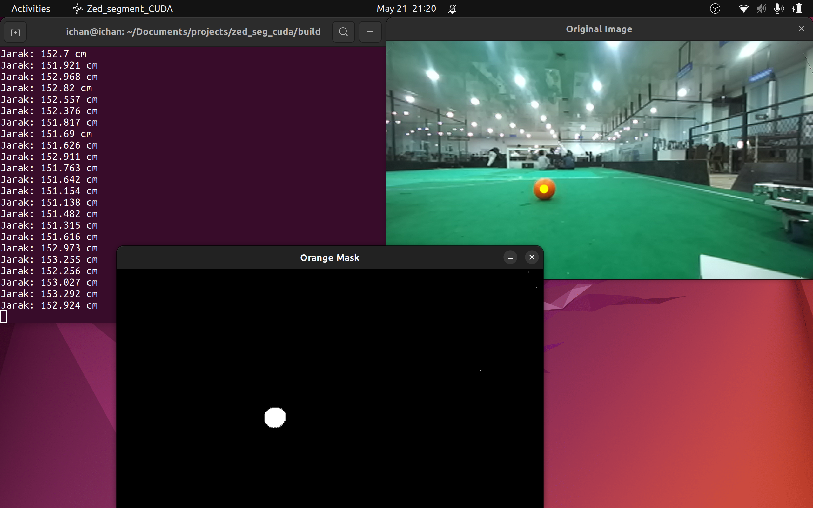

## 🎥🔶 ZED CAMERA SEGMENT USING CUDA

### ⚙️ Requirements

Before you begin, ensure you have:

- ZED SDK — Download here

- ZED Stereo Camera (ZED / ZED Mini / ZED 2) connected via USB 3.0

- OpenCV (v4.x or higher)

- CUDA Toolkit (optional, for GPU acceleration)

- C++17 compatible compiler (GCC, Clang, MSVC)

- CMake for building the project

### 🚀 How to Use

1️⃣ Connect Your ZED Camera

Plug your ZED camera into a USB 3.0 port and confirm your system detects it.

2️⃣ Build the Project

Open a terminal in the project folder, then run:

    mkdir build && cd build
    cmake ..
    make

The executable zed-segment will be created.

3️⃣ Run the Program

Start the program by typing:

    ./zed-segment_CUDA

You will see three windows:

  - Live Camera Feed (detected objects highlighted)

  - Color Mask (segmented areas based on HSV)

  - Trackbars (to adjust HSV thresholds dynamically

4️⃣ Adjust HSV Values

Use the trackbars to tweak the Hue, Saturation, and Value ranges until the target object is well segmented.

5️⃣ Observe Detection & Distance

The largest detected object matching the HSV filter will be circled on the camera feed.

The distance (in centimeters) to the object is printed in the console using the ZED depth data.

6️⃣ Exit

Press q or ESC to quit and close all windows safely.

✨ Enjoy precise color-based object tracking and real-time depth estimation with your ZED camera!

### 📸 Results

